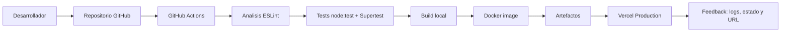

# Proyecto CI/CD - Guia completa de implementacion

Esta guia explica el proyecto tal como esta actualmente: una API Node.js + Express con pruebas automatizadas, analisis estatico, build local, Docker, GitHub Actions, contrato OpenAPI y despliegue continuo en Vercel.

El objetivo del proyecto es demostrar un flujo real de Integracion Continua y Entrega Continua sin depender de pasos manuales repetitivos.

---

## 1. Arquitectura del proyecto

Flujo general:

```text
Desarrollador
  -> GitHub
  -> GitHub Actions
  -> ESLint
  -> Tests con node:test + Supertest
  -> Build local
  -> Build de imagen Docker
  -> Artefactos
  -> Deploy en Vercel
  -> Feedback por Actions y URL publica
```

Diagrama Mermaid:



Herramientas utilizadas:

- GitHub: repositorio remoto y Pull Requests.
- GitHub Actions: pipeline de CI/CD.
- Node.js 20.x: runtime principal.
- Express: framework HTTP de la API.
- node:test: test runner nativo de Node.js.
- Supertest: pruebas HTTP contra la app Express.
- ESLint: analisis estatico de codigo.
- OpenAPI: contrato versionado de la API.
- Docker: empaquetado y validacion de imagen reproducible.
- Docker Compose: ejecucion local de la imagen.
- Vercel: entorno de entrega continua en produccion.

---

## 2. Estructura de carpetas

```text
ci-cd-demo/
|-- .github/
|   `-- workflows/
|       `-- ci.yml              Pipeline CI/CD
|-- api/
|   `-- index.js                Adaptador serverless para Vercel
|-- docs/
|   |-- openapi.json            Contrato OpenAPI
|   `-- slide-contenido.md      Contenido para una diapositiva
|-- public/
|   `-- index.html              Salida estatica requerida por Vercel
|-- src/
|   |-- app.js                  App Express y rutas
|   `-- index.js                Entrada local con app.listen
|-- __tests__/
|   `-- app.test.js             Tests automatizados HTTP
|-- .dockerignore
|-- .env.example
|-- .gitignore
|-- Dockerfile
|-- docker-compose.yml
|-- eslint.config.js
|-- package.json
|-- package-lock.json
|-- README.md
|-- vercel.json
`-- GUIA_COMPLETA.md
```

---

## 3. Aplicacion

La aplicacion es una API Express simple.

Archivo principal de la app:

```text
src/app.js
```

Entrada para ejecucion local:

```text
src/index.js
```

Adaptador para Vercel:

```text
api/index.js
```

La razon de tener `api/index.js` es que Vercel ejecuta funciones serverless desde la carpeta `api`. Ese archivo importa y exporta la misma app Express de `src/app.js`, evitando duplicar logica.

Endpoints disponibles:

| Endpoint | Descripcion |
| --- | --- |
| `GET /` | Devuelve estado general de la API. |
| `GET /health` | Health check usado para verificar que el servicio esta vivo. |
| `GET /home` | Panel HTML de demostracion del pipeline. |
| `GET /openapi.json` | Contrato OpenAPI publicado por la propia API. |
| Rutas desconocidas | Respuesta JSON `404` controlada. |

Ejemplo de respuesta de `/health`:

```json
{
  "status": "healthy",
  "uptime": 12.34
}
```

---

## 4. Variables de entorno

Archivo de ejemplo:

```text
.env.example
```

Contenido:

```text
NODE_ENV=development
PORT=3000
```

Variables:

| Variable | Uso |
| --- | --- |
| `NODE_ENV` | Define el entorno de ejecucion. |
| `PORT` | Puerto HTTP local. Por defecto se usa `3000`. |

No se versiona `.env` porque puede contener configuracion local o sensible.

---

## 5. Instalacion local

Instalar dependencias desde el lockfile:

```bash
npm ci
```

Se usa `npm ci` porque es reproducible y respeta exactamente `package-lock.json`. Es el mismo comando que corre en GitHub Actions y Vercel.

En Windows, si PowerShell bloquea `npm.ps1`, usar:

```bash
npm.cmd ci
```

---

## 6. Ejecucion local

Ejecutar la API:

```bash
npm start
```

O en Windows:

```bash
npm.cmd start
```

Abrir:

```text
http://localhost:3000/health
```

Tambien se puede probar:

```text
http://localhost:3000/
http://localhost:3000/home
http://localhost:3000/openapi.json
```

---

## 7. Scripts del proyecto

Los scripts estan definidos en `package.json`.

| Script | Comando | Que hace |
| --- | --- | --- |
| `start` | `node src/index.js` | Levanta la API local. |
| `dev` | `node src/index.js` | Alias simple para desarrollo. |
| `lint` | `eslint .` | Ejecuta analisis estatico. |
| `validate:openapi` | `node scripts/validate-openapi.js` | Valida la estructura minima del contrato OpenAPI. |
| `test` | `node --test __tests__/app.test.js` | Ejecuta tests automatizados. |
| `build` | `npm run lint && npm run validate:openapi && npm test` | Valida lint, contrato y tests como compuerta local. |

Comandos recomendados antes de subir cambios:

```bash
npm run lint
npm run validate:openapi
npm test
npm run build
```

En Windows:

```bash
npm.cmd run lint
npm.cmd run validate:openapi
npm.cmd test
npm.cmd run build
```

---

## 8. Pruebas automatizadas

Archivo:

```text
__tests__/app.test.js
```

Herramientas:

- `node:test`: test runner nativo de Node.
- `node:assert/strict`: aserciones.
- `supertest`: permite probar endpoints HTTP sin levantar manualmente el servidor.

### Que tipo de tests son

Las pruebas de este proyecto son principalmente tests automatizados de API o tests de endpoints HTTP.

No son tests unitarios puros, porque no prueban una funcion aislada sin dependencias. En cambio, cargan la app Express completa desde `src/app.js` y hacen peticiones HTTP simuladas con Supertest.

Tampoco son tests end-to-end completos de navegador, porque no abren Chrome ni prueban una interfaz grafica real. Se ubican en un punto intermedio: validan el comportamiento observable de la API desde afuera, como lo haria un cliente HTTP.

Por eso se pueden describir como:

- Tests de integracion livianos.
- Tests de API.
- Tests funcionales de endpoints.
- Smoke tests automatizados de comportamiento HTTP.

Son ideales para CI/CD porque son rapidos, deterministas y verifican que la aplicacion responda correctamente antes de construir Docker o desplegar.

### Como funcionan tecnicamente

El test importa la app:

```js
const app = require('../src/app');
```

Ese archivo exporta la instancia de Express, pero no llama a `app.listen`. Esto es importante porque permite que Supertest pruebe la app en memoria sin ocupar el puerto `3000`.

Supertest hace peticiones como esta:

```js
const res = await request(app).get('/health');
```

Despues, `node:assert/strict` valida que la respuesta tenga los valores esperados:

```js
assert.equal(res.statusCode, 200);
assert.equal(res.body.status, 'healthy');
```

Si una asercion falla, el comando `npm test` termina con error. En GitHub Actions eso corta el pipeline y evita que se avance a Docker o deploy.

### Pruebas incluidas

1. `GET /` responde `200`, `status: ok`, mensaje y version.
2. `GET /health` responde `200`, `status: healthy` y `uptime` numerico.
3. `GET /home` responde `200` y devuelve la pagina HTML de demostracion con referencia a Vercel.
4. `GET /openapi.json` expone el contrato OpenAPI y contiene rutas importantes.
5. Una ruta desconocida responde `404` con JSON controlado.

### Detalle de cada prueba

#### 1. Test del endpoint principal `GET /`

Objetivo:

Validar que la API principal este disponible y devuelva una respuesta JSON coherente.

Verifica:

- Codigo HTTP `200`.
- Header `content-type` JSON.
- Campo `status` igual a `ok`.
- Campo `message` igual a `CI/CD Demo API`.
- Campo `version` igual a la version declarada en `docs/openapi.json`.

Importancia:

Este test confirma que la API responde y que existe consistencia entre el codigo y el contrato OpenAPI.

#### 2. Test de health check `GET /health`

Objetivo:

Validar que el servicio tenga un endpoint simple para comprobar si esta vivo.

Verifica:

- Codigo HTTP `200`.
- Header `content-type` JSON.
- Campo `status` igual a `healthy`.
- Campo `uptime` de tipo numerico.

Importancia:

Este endpoint sirve para monitoreo, smoke tests y validacion de despliegue. Tambien se usa en Docker para comprobar que el contenedor responde correctamente.

#### 3. Test de la pagina de demo `GET /home`

Objetivo:

Validar que la vista HTML usada en la demostracion publica siga disponible.

Verifica:

- Codigo HTTP `200`.
- Header `content-type` HTML.
- Presencia del texto `CI/CD Pipeline Demo`.
- Presencia de `OpenAPI`.
- Presencia de la palabra `Vercel`.

Importancia:

Este test agrega cobertura sobre la parte visible de la demo. No es una prueba visual de navegador, pero confirma que el endpoint HTML existe y muestra contenido coherente con el despliegue actual.

#### 4. Test del contrato `GET /openapi.json`

Objetivo:

Validar que la especificacion OpenAPI este publicada por la propia aplicacion.

Verifica:

- Codigo HTTP `200`.
- Version OpenAPI `3.0.3`.
- Existencia de la ruta `/` en el contrato.
- Existencia de la ruta `/health` en el contrato.
- Existencia de la ruta `/home` en el contrato.

Importancia:

Este test conecta la practica de Spec Driven Development con el pipeline. No solo se prueba que la API funcione, sino tambien que publique su contrato.

#### 5. Test de error controlado `GET /missing-route`

Objetivo:

Validar que la API responda de forma predecible cuando una ruta no existe.

Verifica:

- Codigo HTTP `404`.
- Header `content-type` JSON.
- Campo `status` igual a `not_found`.
- Mensaje que incluye la ruta solicitada.

Importancia:

Este test mejora la calidad del contrato HTTP. En vez de devolver una respuesta HTML generica de Express, la API devuelve un error JSON consistente y facil de consumir por clientes o monitores.

### Que cubren y que no cubren

Cubren:

- Respuestas HTTP de endpoints criticos.
- Codigos de estado.
- Campos principales del JSON.
- Relacion entre la API y el contrato OpenAPI.
- Health check usado en CI/CD.
- Pagina HTML de demo.
- Errores 404 controlados.

No cubren:

- Pruebas visuales de la pagina `/home`.
- Pruebas de carga o rendimiento.
- Pruebas de seguridad avanzadas.
- Pruebas end-to-end con navegador real.
- Validacion exhaustiva de todo el schema OpenAPI.

Para el alcance de la evaluacion CI/CD, son suficientes porque demuestran una verificacion automatica real, rapida y repetible.

Ejecutar:

```bash
npm test
```

Resultado esperado:

```text
tests 5
pass 5
fail 0
```

Como se interpretan los resultados:

- `tests 5`: se ejecutaron cinco casos de prueba.
- `pass 5`: los cinco pasaron correctamente.
- `fail 0`: no hubo fallos.

Estas pruebas corren en tres lugares:

1. Localmente, cuando el desarrollador ejecuta `npm test`.
2. En GitHub Actions, dentro del job `quality`.
3. Dentro del build Docker, porque el Dockerfile ejecuta `npm run build`.

Esto garantiza que el mismo comportamiento se valida antes de integrar, antes de empaquetar y antes de desplegar.

---

## 9. Analisis estatico

Archivo:

```text
eslint.config.js
```

ESLint revisa errores comunes como variables no definidas o variables sin usar.

Ejecutar:

```bash
npm run lint
```

Si ESLint falla, el pipeline se detiene antes de test, build, Docker y deploy.

---

## 10. Spec Driven Development

El proyecto incorpora una capacidad pequena pero real de Spec Driven Development usando OpenAPI.

Archivo:

```text
docs/openapi.json
```

La app lo expone en:

```text
GET /openapi.json
```

El endpoint `/` devuelve la version definida en el contrato:

```js
version: openApiSpec.info.version
```

Esto vincula:

- especificacion;
- codigo;
- pruebas;
- documentacion.

Por eso, si cambia la version del contrato, la API y los tests ayudan a detectar inconsistencias.

Ademas, el proyecto incluye un validador propio:

```text
scripts/validate-openapi.js
```

Se ejecuta con:

```bash
npm run validate:openapi
```

Que valida:

- version OpenAPI `3.0.3`;
- presencia de `info.title`;
- presencia de `info.version`;
- existencia del objeto `paths`;
- definicion de `GET /`;
- definicion de `GET /health`;
- definicion de `GET /home`;
- definicion de `GET /openapi.json`;
- existencia de los schemas `RootResponse` y `HealthResponse`.

Esto hace que el pipeline no dependa solamente de que el archivo JSON exista. Tambien verifica que tenga la estructura minima que la API y la documentacion necesitan.

---

## 11. Docker

Archivos:

```text
Dockerfile
.dockerignore
docker-compose.yml
```

El `Dockerfile` usa dos etapas:

1. `builder`: instala dependencias, copia el proyecto y ejecuta `npm run build`.
2. `production`: instala solo dependencias de produccion y copia la app validada.

Build local:

```bash
docker build -t ci-cd-demo:local .
```

Ejecutar imagen:

```bash
docker run --rm -p 3000:3000 ci-cd-demo:local
```

Probar:

```text
http://localhost:3000/health
```

Con Docker Compose:

```bash
docker compose up --build
```

El servicio de Compose incluye un `healthcheck` que consulta `/health`. Eso permite que Docker marque el contenedor como saludable si la API responde correctamente.

Bajar el entorno:

```bash
docker compose down
```

Docker no reemplaza a Vercel en este proyecto. Se usa para demostrar empaquetado reproducible, build verificable y artefacto dentro del pipeline.

---

## 12. GitHub Actions

Archivo:

```text
.github/workflows/ci.yml
```

Eventos que disparan el pipeline:

- push a `main`;
- pull request hacia `main`.

Jobs:

### 12.1 Quality, tests and local build

Pasos:

1. Checkout del repositorio.
2. Setup de Node.js 20.
3. Instalacion con `npm ci`.
4. Analisis estatico con `npm run lint`.
5. Validacion del contrato con `npm run validate:openapi`.
6. Tests con `npm test`.
7. Build local con `npm run build`.
8. Upload del contrato OpenAPI como artefacto.

### 12.2 Docker image

Depende del job anterior.

Pasos:

1. Build de imagen Docker.
2. Smoke test HTTP contra `/health`.
3. Export de imagen con `docker save`.
4. Upload de imagen Docker como artefacto.

### 12.3 Deploy to Vercel

Depende de Docker.

Condicion:

```text
solo corre en push a main
```

Pasos:

1. Checkout.
2. Instalacion de Vercel CLI.
3. Validacion de secretos.
4. `vercel pull`.
5. `vercel build --prod`.
6. `vercel deploy --prebuilt --prod`.

Si faltan secretos, el job no rompe el pipeline: muestra una advertencia y omite el deploy.

---

## 13. Vercel

Archivos relacionados:

```text
vercel.json
api/index.js
public/index.html
```

Configuracion actual en `vercel.json`:

```json
{
  "version": 2,
  "installCommand": "npm ci",
  "buildCommand": "npm run build",
  "outputDirectory": "public",
  "rewrites": [
    {
      "source": "/(.*)",
      "destination": "/api/index.js"
    }
  ]
}
```

Explicacion:

- `installCommand`: Vercel instala dependencias con `npm ci`.
- `buildCommand`: Vercel valida el proyecto con `npm run build`.
- `outputDirectory`: Vercel espera una carpeta de salida, por eso existe `public`.
- `rewrites`: todas las rutas llegan a la funcion serverless `api/index.js`.

Configuracion recomendada en Vercel:

- Framework Preset: `Other`.
- Install Command: `npm ci`.
- Build Command: `npm run build`.
- Output Directory: `public` o vacio si toma `vercel.json`.
- Root Directory: raiz del repositorio.
- Node.js Version: `20.x`.

URLs utiles despues del deploy:

```text
https://TU-DOMINIO.vercel.app/
https://TU-DOMINIO.vercel.app/health
https://TU-DOMINIO.vercel.app/home
https://TU-DOMINIO.vercel.app/openapi.json
```

---

## 14. Secretos necesarios

Para desplegar desde GitHub Actions hacia Vercel se necesitan estos secrets en GitHub:

| Secret | Descripcion |
| --- | --- |
| `VERCEL_TOKEN` | Token personal de Vercel para permitir deploys desde CI. |
| `VERCEL_ORG_ID` | ID del usuario/equipo de Vercel. |
| `VERCEL_PROJECT_ID` | ID del proyecto en Vercel. |

Donde cargarlos:

```text
GitHub -> Repo -> Settings -> Secrets and variables -> Actions
```

No se deben guardar tokens dentro del codigo.

---

## 15. Estrategia de ramas

Estrategia simple recomendada:

- `main`: rama estable y desplegable.
- `feature/nombre`: nuevas funcionalidades.
- `fix/nombre`: correcciones.
- Pull Request hacia `main`.
- El PR debe pasar lint, tests, build y Docker antes de merge.
- El deploy a Vercel ocurre al integrar cambios en `main`.

Esto evita desplegar codigo que no paso por controles automaticos.

---

## 16. Paso a paso para una demo

Duracion sugerida: menos de 5 minutos.

### 0:00 - 0:40 Mostrar arquitectura

Mostrar el diagrama:

```text
Dev -> GitHub -> Actions -> Lint -> Tests -> Build -> Docker -> Vercel
```

Frase:

> "Cada cambio que subo a GitHub activa controles automaticos. Si algo falla, no se despliega."

### 0:40 - 1:20 Mostrar la app

Archivos:

```text
src/app.js
api/index.js
```

Explicar:

> "La app es Express. Localmente corre con src/index.js y en Vercel se exporta como funcion serverless desde api/index.js."

### 1:20 - 2:00 Mostrar tests

Archivo:

```text
__tests__/app.test.js
```

Explicar:

> "Los tests prueban endpoints reales con Supertest: raiz, health check, pagina HTML, contrato OpenAPI y errores 404."

Ejecutar:

```bash
npm test
```

### 2:00 - 2:40 Mostrar build local

Ejecutar:

```bash
npm run build
```

Explicar:

> "El build local es una compuerta: analiza codigo con ESLint, valida el contrato OpenAPI y despues corre los tests."

### 2:40 - 3:30 Mostrar pipeline

Archivo:

```text
.github/workflows/ci.yml
```

Explicar jobs:

- quality;
- docker;
- deploy.

Frase:

> "Docker depende de quality y deploy depende de Docker. Asi se garantiza el orden."

### 3:30 - 4:20 Mostrar Vercel

Abrir la URL publica.

Probar:

```text
/health
/openapi.json
```

Frase:

> "El despliegue final queda publicado en Vercel y se puede validar con el health check."

### 4:20 - 5:00 Cierre

Frase:

> "El proyecto demuestra CI y CD: integra, analiza, prueba, construye, genera artefactos y despliega automaticamente."

---

## 17. Preguntas teoricas y respuestas

### Que es CI?

CI significa Integracion Continua. Es la practica de integrar cambios frecuentemente y validarlos automaticamente con herramientas como lint, tests y build.

### Que es CD?

CD puede significar Entrega Continua o Despliegue Continuo. En este proyecto significa que, despues de pasar los controles, el codigo se publica automaticamente en Vercel desde la rama `main`.

### Por que usar GitHub Actions?

Porque permite automatizar el flujo completo dentro del repositorio: instalacion, analisis, pruebas, build, Docker y deploy.

### Por que usar Vercel?

Porque permite desplegar rapidamente aplicaciones Node.js con funciones serverless, integra bien con GitHub y da una URL publica para demostrar el resultado.

### Por que usar Docker si se despliega en Vercel?

Porque Docker demuestra reproducibilidad y empaquetado. Aunque Vercel no use esa imagen para publicar, el pipeline valida que el proyecto tambien puede construirse y ejecutarse como contenedor.

### Que pasa si falla un test?

Falla el job de quality. Como Docker depende de quality y deploy depende de Docker, no se genera imagen ni se despliega.

### Que pasa si faltan secretos de Vercel?

El deploy se omite con una advertencia. El resto del pipeline sigue sirviendo para validar CI.

### Que aporta OpenAPI?

OpenAPI documenta el contrato de la API. En este proyecto tambien se expone desde `/openapi.json` y los tests verifican que este disponible.

---

## 18. Checklist de requisitos cumplidos

- Entorno local reproducible con `npm ci`.
- Comando de ejecucion con `npm start`.
- Comando de analisis con `npm run lint`.
- Tests automatizados con `npm test`.
- Build local con `npm run build`.
- `.env.example` presente.
- `.gitignore` configurado.
- GitHub Actions en push y pull request hacia `main`.
- Pipeline con checkout, setup Node, install, lint, tests, build, Docker y artefactos.
- Deploy continuo a Vercel.
- Secretos documentados sin exponer credenciales.
- Dockerfile y Docker Compose presentes.
- OpenAPI como contrato de API.
- README y guia completa actualizados.
- Diagrama Mermaid incluido.
- Guia de demo oral incluida.

---

## 19. Comandos finales de validacion

Ejecutar localmente:

```bash
npm ci
npm run lint
npm run validate:openapi
npm test
npm run build
docker build -t ci-cd-demo:local .
docker compose up --build
```

Probar:

```text
http://localhost:3000/health
```

Bajar Docker Compose:

```bash
docker compose down
```

Validar workflow YAML:

```bash
npx --yes yaml-lint .github/workflows/ci.yml
```

En Windows se puede usar `npm.cmd` y `npx.cmd` si PowerShell bloquea scripts:

```bash
npm.cmd ci
npm.cmd run lint
npm.cmd run validate:openapi
npm.cmd test
npm.cmd run build
npx.cmd --yes yaml-lint .github/workflows/ci.yml
```

---

## 20. Resumen para entregar

Este proyecto implementa un pipeline CI/CD completo sobre una API Express. El codigo se sube a GitHub, GitHub Actions instala dependencias, analiza el codigo con ESLint, ejecuta tests HTTP reales, valida el build, construye una imagen Docker, guarda artefactos y despliega en Vercel usando secretos seguros. La API expone un contrato OpenAPI y un endpoint de health check para validar la entrega.
