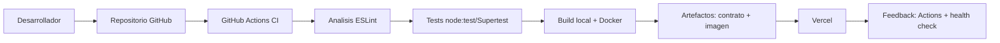

# CI/CD Demo

[](https://github.com/ivocettour/ci-cd-demo/actions/workflows/ci.yml)

API Node.js + Express preparada para demostrar Integracion Continua y Entrega Continua 

## Tecnologias

- Node.js 20.x
- Express
- Node test runner y Supertest para pruebas automatizadas
- ESLint para analisis estatico
- OpenAPI como contrato de API
- Docker y Docker Compose
- GitHub Actions para CI/CD
- Vercel como entorno de entrega simple

## Instalacion

```bash
npm ci
```

Para configurar variables locales:

```bash
cp .env.example .env
```

Variables disponibles:

| Variable | Valor sugerido | Uso |
| --- | --- | --- |
| `NODE_ENV` | `development` | Modo de ejecucion |
| `PORT` | `3000` | Puerto HTTP |

## Ejecucion local

```bash
npm start
```

Endpoints utiles:

- `GET /`: estado general de la API.
- `GET /health`: health check para CI/CD y Vercel.
- `GET /home`: panel HTML de demostracion del pipeline.
- `GET /openapi.json`: contrato OpenAPI.
- Rutas desconocidas: respuesta JSON `404` controlada.

## Tests, analisis y build

```bash
npm run lint
npm run validate:syntax
npm run validate:openapi
npm test
npm run build
```

En este stack el build local funciona como compuerta verificable: valida sintaxis JS/JSON, ejecuta ESLint, valida el contrato OpenAPI y corre las pruebas automatizadas. La imagen Docker se construye en CI y tambien puede construirse localmente.

## Docker

Build directo:

```bash
docker build -t ci-cd-demo .
docker run --rm -p 3000:3000 ci-cd-demo
```

Con Docker Compose:

```bash
docker compose up --build
```

Luego abrir `http://localhost:3000/health`.

Docker Compose incluye un `healthcheck` que consulta `/health` para marcar el contenedor como saludable.

## Pipeline CI/CD

El workflow esta en `.github/workflows/ci.yml` y corre en:

- push a `main`;
- pull requests hacia `main`.

Etapas:

1. Checkout del repositorio.
2. Setup de Node.js 20 con cache npm.
3. Instalacion con `npm ci`.
4. Validacion de sintaxis JavaScript y JSON.
5. Analisis estatico con ESLint.
6. Validacion del contrato OpenAPI.
7. Tests con `node:test` y Supertest.
8. Build local con `npm run build`.
9. Build y smoke test de imagen Docker.
10. Publicacion del contrato OpenAPI y export de imagen Docker como artefactos.
11. Deploy a Vercel en push a `main`.



## Despliegue

La entrega continua queda configurada para Vercel:

- `vercel.json` define la instalacion, build, salida `public` y rewrite hacia la funcion serverless.
- `api/index.js` adapta la misma app Express para Vercel.
- GitHub Actions despliega con Vercel CLI solo en push a `main`.
- El deploy solo corre si pasaron lint, validacion OpenAPI, tests, build y Docker.

Secreto necesario en GitHub:

| Secret | Descripcion |
| --- | --- |
| `VERCEL_TOKEN` | Token de Vercel para desplegar desde GitHub Actions. |
| `VERCEL_ORG_ID` | ID del equipo o usuario de Vercel. |
| `VERCEL_PROJECT_ID` | ID del proyecto de Vercel. |

Si esos secretos no existen, el workflow deja una advertencia y omite el deploy. No se incluyen credenciales en el repositorio.

## Estrategia de ramas

- `main`: rama estable y desplegable.
- `feature/*` o `fix/*`: cambios de trabajo.
- Abrir Pull Request hacia `main`.
- El PR debe pasar lint, tests, build y Docker antes de merge.
- El deploy automatico ocurre solo al integrar en `main`.

## Spec Driven Development

El contrato vive en `docs/openapi.json` y la app lo expone en `/openapi.json`. El comando `npm run validate:openapi` verifica la estructura minima requerida del contrato, incluyendo `/home`. Los tests verifican que el endpoint exista y que la version devuelta por `/` coincida con el contrato.

## Demo oral en menos de 5 minutos

1. Mostrar `README.md` y el diagrama Mermaid: "El flujo va del desarrollador al repositorio, CI, pruebas, build, artefacto, entrega y feedback".
2. Mostrar `src/app.js`: "La API tiene endpoints de estado, health check, home y contrato OpenAPI".
3. Mostrar `__tests__/app.test.js`: "Las pruebas validan API JSON, pagina HTML, contrato OpenAPI y errores 404 con Supertest".
4. Ejecutar `npm run build`: "Esta compuerta local corre analisis, contrato OpenAPI y tests".
5. Mostrar `.github/workflows/ci.yml`: "El mismo flujo corre en push y pull request; Docker genera el artefacto".
6. Mostrar `vercel.json`: "Vercel publica la app Express mediante una funcion serverless y secretos de GitHub".

## Estado esperado

```bash
npm ci
npm run lint
npm run validate:syntax
npm run validate:openapi
npm test
npm run build
docker build -t ci-cd-demo .
docker compose up --build
```

Todos los comandos deben completarse sin errores en un entorno con Node.js, npm y Docker disponibles.
