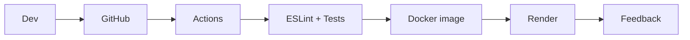

# Diapositiva unica: CI/CD Demo

## Titulo

Pipeline CI/CD para API Node.js + Express

## Herramientas y logos sugeridos

- GitHub: repositorio y Pull Requests
- GitHub Actions: CI/CD
- Node.js + Express: aplicacion
- Node test runner + Supertest: pruebas
- ESLint: analisis estatico
- Docker: imagen reproducible
- Render: entrega continua
- OpenAPI: contrato de API

## Diagrama resumido

## Guion oral breve

"Este proyecto demuestra un flujo CI/CD completo sobre una API Express. Cada push o pull request instala dependencias con npm ci, corre analisis estatico con ESLint, ejecuta pruebas reales con node:test y Supertest, valida el build local y construye una imagen Docker. En la rama main, si todo pasa, GitHub Actions dispara el deploy en Render mediante un secreto. Ademas, el contrato OpenAPI queda versionado y expuesto por la propia API, conectando especificacion, codigo y pruebas."

## Criterios de aceptacion vinculados al codigo

- `/health` debe responder `status: healthy`.
- `/` debe responder el mensaje de la API y la version del contrato.
- `/openapi.json` debe publicar el contrato OpenAPI versionado.
- El pipeline no despliega si lint, tests, build o Docker fallan.
